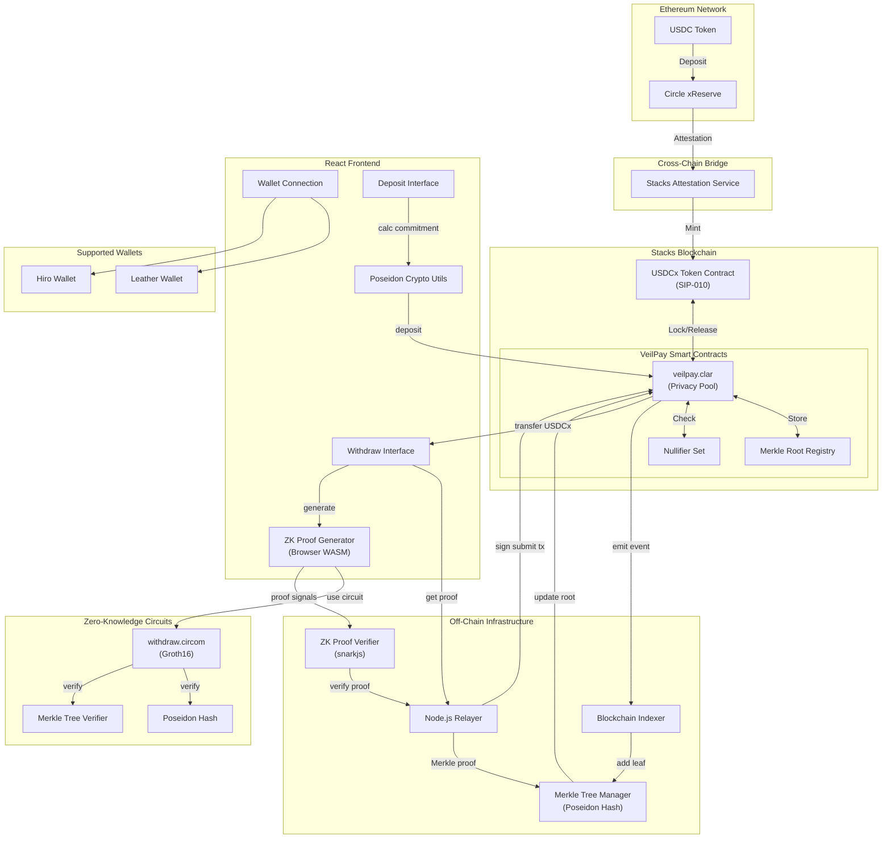
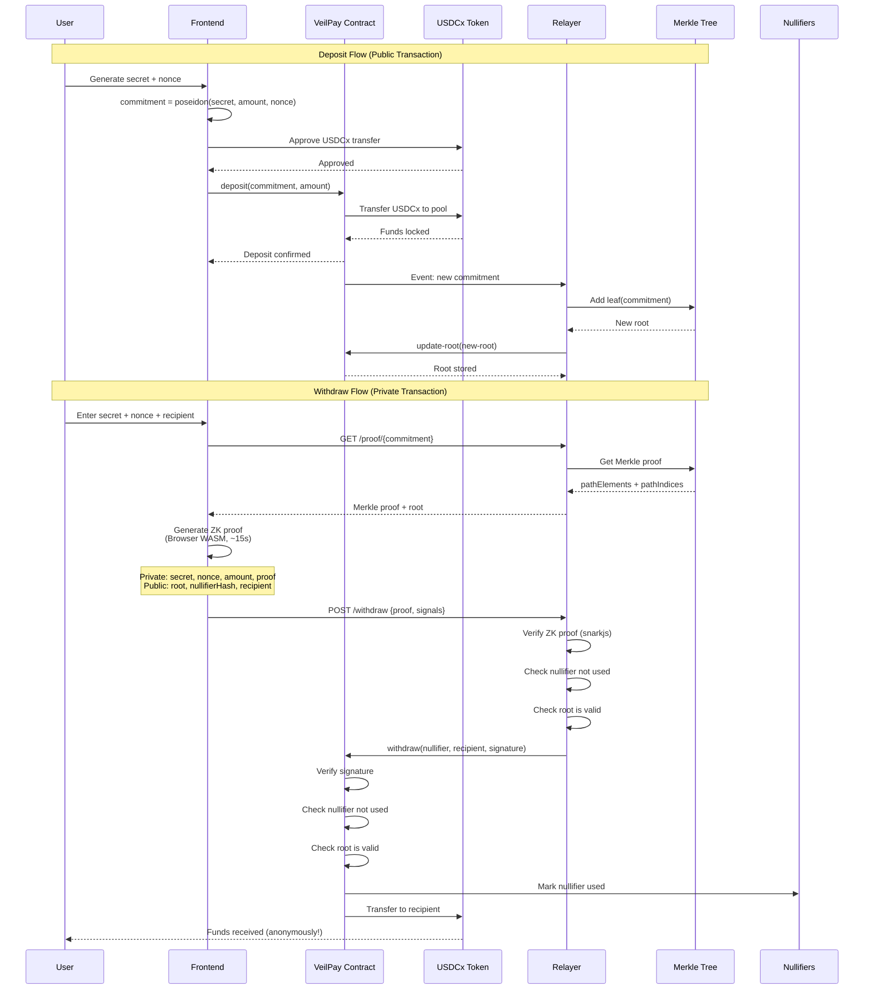

<div align="center">


# VeilPay

**Zero-Knowledge Privacy Protocol for USDCx on Stacks**

[](https://www.stacks.co/)
[](https://www.circle.com/)
[](https://opensource.org/licenses/MIT)
[](http://makeapullrequest.com)

[](https://explorer.hiro.so/?chain=testnet)
[](https://clarity-lang.org/)
[](https://docs.circom.io/)
[](https://react.dev/)
[](https://vitejs.dev/)

[Live Demo](#) · [Documentation](./CLAUDE.md) · [Smart Contracts](#smart-contracts-testnet) · [Report Bug](https://github.com/carlos-israelj/VeilPay/issues)

---

</div>

## Table of Contents

- [Overview](#overview)
- [Core Features](#core-features)
- [Technical Specifications](#technical-specifications)
- [How It Works](#how-it-works)
- [Architecture](#architecture)
- [Quick Start](#quick-start)
- [Smart Contracts](#smart-contracts-testnet)
- [Technology Stack](#technology-stack)
- [Real-World Use Cases](#real-world-use-cases)
- [Technical Deep Dive](#technical-deep-dive)
- [Roadmap](#roadmap)
- [Why VeilPay Matters](#why-veilpay-matters)
- [Security Model](#security-model)
- [FAQ](#frequently-asked-questions)
- [Contributing](#contributing)

---

## Overview

VeilPay is the **first Zero-Knowledge privacy protocol** for USDCx on Stacks, enabling completely private, anonymous transfers using state-of-the-art cryptographic techniques. By leveraging Groth16 ZK-SNARKs and Poseidon hash functions, VeilPay breaks on-chain surveillance while maintaining the stability and regulatory compliance of Circle's USDCx stablecoin.

### The Privacy Problem

Blockchain transparency is a fundamental feature—but it comes at a cost. Every transaction is publicly visible, exposing:
- Complete transaction history
- Wallet balances and holdings
- Sender-receiver relationships
- Spending patterns and behavior

**VeilPay solves this** by providing cryptographic privacy guarantees through Zero-Knowledge proofs, allowing you to maintain financial confidentiality without sacrificing decentralization or security.

---

## Core Features

VeilPay provides enterprise-grade privacy for USDCx transfers through a sophisticated cryptographic architecture:

### Privacy-Preserving Deposits
Lock USDCx in smart contract with cryptographic commitments using Poseidon hash function. Deposits are represented as `commitment = poseidon(secret, amount, nonce)`, revealing nothing about the transaction details.

### Anonymous Withdrawals
Prove ownership of a deposit without revealing which specific deposit is yours. Zero-Knowledge proofs enable withdrawal to any address with complete unlinkability from the original deposit.

### Merkle Tree Accumulator
Efficient commitment storage with 1,048,576+ capacity (20-level tree). All deposits exist in the same anonymity set, maximizing privacy guarantees.

### Nullifier Protection
Cryptographic nullifiers prevent double-spending while maintaining privacy. Each deposit can only be withdrawn once, enforced on-chain without revealing identity.

### Client-Side Proof Generation
Browser-based Zero-Knowledge proof creation using WebAssembly circuits. No backend required—privacy is guaranteed by mathematics, not trust.

### Hybrid Verification Architecture
Off-chain proof verification via relayer with on-chain settlement. Designed for future migration to native on-chain verification when Stacks adds SNARK precompiles.

---

## Technical Specifications

| Component | Technology | Performance | Security |
|-----------|------------|-------------|----------|
| **ZK Proof System** | Groth16 SNARKs | ~15s generation, <10ms verification* | 128-bit security, ~1M constraints |
| **Hash Function** | Poseidon | ~10x faster than SHA-256 in circuits | SNARK-friendly, collision-resistant |
| **Privacy Set** | 20-level Merkle tree | 1,048,576 deposit capacity | Cryptographic accumulator |
| **Proof Size** | Groth16 | 192 bytes (3 curve points) | Constant size, succinct |
| **Smart Contract** | Clarity v2 | Gas-optimized deposit/withdraw | Type-safe, decidable |
| **Token Integration** | USDCx (SIP-010) | Native fungible token support | Circle-backed stablecoin |

<sub>* On-chain verification timing when Stacks adds SNARK precompiles</sub>

---

## How It Works

VeilPay implements a cryptographic privacy protocol through a two-phase process:

### Phase 1: Deposit

```
User generates:
  secret (256-bit random)
  nonce (256-bit random)

Calculate commitment:
  commitment = Poseidon(secret, amount, nonce)

Submit to blockchain:
  deposit(commitment, amount) → Lock USDCx in contract

Off-chain indexer:
  Add commitment to Merkle tree → Update root on-chain
```

**Result**: USDCx is locked in smart contract. Only the commitment hash is public—the secret, amount, and nonce remain private.

### Phase 2: Withdrawal

```
User requests:
  Merkle proof for commitment from relayer

Generate ZK proof (browser):
  Prove: "I know secret for some commitment in tree"
  Public: root, nullifierHash, recipient
  Private: secret, amount, nonce, merkle_proof

Submit to relayer:
  Relayer verifies proof → Signs transaction

Smart contract validates:
  1. Relayer signature valid
  2. Root exists in valid roots
  3. Nullifier not used
  4. Release USDCx to recipient
```

**Result**: USDCx is transferred to recipient address. No on-chain link between deposit and withdrawal.

### Privacy Guarantees

**Mathematical Unlinkability**: Zero-Knowledge proofs cryptographically guarantee that deposits and withdrawals cannot be correlated. Even with full blockchain access, an adversary cannot determine which deposit corresponds to which withdrawal.

**Key Properties**:
- **Commitment Hiding**: Poseidon hash reveals nothing about secret, amount, or nonce
- **Nullifier Unlinkability**: Cannot be traced back to original commitment
- **Anonymity Set**: All deposits in tree are indistinguishable
- **Non-Interactive**: No communication required between users

---

## Architecture



### System Components

**Frontend Layer** (React + Vite)
- Zero-Knowledge proof generation (snarkjs + WASM)
- Poseidon hash commitment calculation (circomlibjs)
- Wallet integration (@stacks/connect)
- Deposit/Withdrawal UI

**Off-Chain Layer** (Node.js + Express)
- Merkle tree manager (Poseidon hash)
- ZK proof verification (snarkjs)
- Blockchain event indexer
- Transaction relayer with signature

**Smart Contract Layer** (Clarity)
- Privacy pool contract (deposit/withdraw)
- Merkle root registry (valid roots)
- Nullifier tracking (double-spend prevention)
- USDCx token interface (SIP-010)

**ZK Circuit Layer** (Circom)
- Withdrawal circuit (Groth16 proof system)
- Poseidon hash constraints
- Merkle tree verification (20 levels)
- Nullifier derivation

**Blockchain Layer**
- Stacks L2 (Transaction Settlement)
- Bitcoin L1 (Security Anchor)
- Ethereum L1 (USDC Source Chain)

---

## Privacy Flow



### Privacy Guarantees

**Unlinkability**: Cannot correlate which deposit → which withdrawal because:
- **Commitment hiding**: `poseidon(secret, amount, nonce)` reveals nothing about the inputs
- **Nullifier hiding**: `poseidon(secret, nonce)` is unique per deposit but unlinkable to commitment
- **ZK proof**: Proves "I know a secret for *some* commitment in the tree" without revealing which one
- **Merkle tree**: All deposits are in the same anonymity set (1M+ capacity)

**Security Properties**:
- ✅ **Privacy**: Deposits and withdrawals are cryptographically unlinkable
- ✅ **No double-spending**: Nullifiers prevent claiming the same deposit twice
- ✅ **Non-custodial**: Only commitment owner can generate valid proof
- ✅ **Trustless**: ZK proofs are cryptographically verified (trust relayer only for censorship resistance)

### Privacy Process Steps

**Deposit Phase:**
1. **Secret Generation**: User generates random secret and nonce (256-bit entropy, client-side)
2. **Commitment Creation**: Calculate `commitment = poseidon(secret, amount, nonce)`
3. **Lock Funds**: Transfer USDCx to privacy pool smart contract
4. **Tree Update**: Relayer indexes deposit event and adds commitment to Merkle tree
5. **Save Credentials**: User securely stores secret and nonce for future withdrawal

**Withdrawal Phase:**
1. **Proof Request**: User requests Merkle proof for their commitment from relayer
2. **ZK Generation**: Browser generates Zero-Knowledge proof using WASM circuit (~15s)
3. **Proof Verification**: Relayer verifies proof validity with snarkjs off-chain
4. **Transaction Submission**: Relayer signs verified proof and submits withdrawal transaction
5. **Privacy Transfer**: Smart contract releases USDCx to recipient - completely unlinkable from deposit!

---

## Application Screenshots

### Deposit Interface
*Lock USDCx with cryptographic commitment for complete privacy*


### Withdrawal Interface
*Withdraw to any address with Zero-Knowledge proof - completely unlinkable*


### Merkle Tree Visualization
*1M+ capacity privacy pool with efficient cryptographic proofs*


### Proof Generation
*Browser-based ZK proof generation in ~15 seconds*


---

## Project Structure

```
VeilPay/
├── circuits/                     # Circom ZK Circuits
│   ├── withdraw.circom           # Main withdrawal circuit (20 levels)
│   ├── build/                    # Compiled circuit artifacts
│   │   ├── withdraw.wasm         # Circuit WebAssembly
│   │   ├── withdraw_final.zkey   # Proving key (3MB)
│   │   └── verification_key.json # Verification key
│   ├── scripts/build.sh          # Circuit compilation script
│   ├── test/                     # Circuit unit tests
│   └── package.json
│
├── contracts/                    # Clarity Smart Contracts
│   ├── veilpay.clar              # Privacy pool contract
│   ├── usdcx-trait.clar          # SIP-010 token trait
│   ├── Clarinet.toml             # Clarinet configuration
│   └── deployments/              # Deployment configs
│
├── relayer/                      # Node.js Relayer Service
│   ├── src/
│   │   ├── index.js              # Express API server
│   │   ├── merkle.js             # Merkle tree manager (Poseidon)
│   │   ├── verifier.js           # ZK proof verifier (snarkjs)
│   │   ├── indexer.js            # Blockchain event indexer
│   │   ├── stacks-client.js      # Stacks transaction builder
│   │   ├── signer.js             # Relayer signature logic
│   │   ├── withdraw.wasm         # Circuit WASM (for verification)
│   │   ├── withdraw_final.zkey   # Proving key
│   │   └── verification_key.json # Verification key
│   ├── .env.example              # Environment template
│   └── package.json
│
├── frontend/                     # React + Vite Frontend
│   ├── src/
│   │   ├── App.jsx               # Main application
│   │   ├── components/           # React components
│   │   │   ├── Deposit.jsx       # Deposit interface
│   │   │   └── Withdraw.jsx      # Withdrawal interface
│   │   ├── utils/
│   │   │   ├── crypto.js         # Poseidon hash utilities
│   │   │   └── proof.js          # ZK proof generation
│   │   ├── main.jsx              # Entry point
│   │   └── index.css
│   ├── public/
│   │   └── circuits/             # Circuit files for browser
│   │       ├── withdraw.wasm
│   │       └── withdraw_final.zkey
│   ├── .env.example
│   ├── vite.config.js
│   ├── tailwind.config.js
│   └── package.json
│
├── docs/                         # Documentation
├── CLAUDE.md                     # Developer guide for Claude Code
├── README.md                     # This file
├── TESTNET_GUIDE.md              # Testnet deployment guide
├── LICENSE                       # MIT License
├── package.json                  # Workspace root
└── vercel.json                   # Vercel deployment config
```

---

## Quick Start

### Prerequisites

- **Node.js** v18+ ([Download](https://nodejs.org/))
- **Clarinet** for contract deployment ([Install](https://github.com/hirosystems/clarinet))
- **Circom** (installed via npm, or system-wide from [docs](https://docs.circom.io))
- **Stacks Wallet**: [Leather](https://leather.io/) or [Hiro](https://wallet.hiro.so/)
- **MetaMask** (optional, for bridging USDC from Ethereum)

### Installation

```bash
# Clone the repository
git clone https://github.com/carlos-israelj/VeilPay.git
cd VeilPay

# Install all workspace dependencies (circuits, relayer, frontend)
npm install
```

### Running the Application

**Terminal 1 - Start Relayer:**
```bash
# Configure relayer environment
cd relayer
cp .env.example .env
# Edit .env with your settings (see Configuration section)

# Start relayer
npm run dev
# Or use root workspace command
npm run dev:relayer
```

**Terminal 2 - Start Frontend:**
```bash
# Configure frontend environment
cd frontend
cp .env.example .env
# Edit .env with API URL

# Start frontend
npm run dev
# Or use root workspace command
npm run dev:frontend
```

**Access the application:**
- Frontend: http://localhost:3000
- Relayer API: http://localhost:3001

### Environment Configuration

**Relayer** (`relayer/.env`):
```env
# Relayer Configuration
PORT=3001
RELAYER_PRIVATE_KEY=your_stacks_private_key_hex

# Stacks Network
STACKS_NETWORK=testnet  # or mainnet
CONTRACT_ADDRESS=ST1PQHQKV0RJXZFY1DGX8MNSNYVE3VGZJSRTPGZGM
CONTRACT_NAME=veilpay

# USDCx Token Contract
USDCX_ADDRESS=ST1PQHQKV0RJXZFY1DGX8MNSNYVE3VGZJSRTPGZGM
USDCX_NAME=usdcx
```

**Frontend** (`frontend/.env`):
```env
VITE_API_URL=http://localhost:3001
VITE_STACKS_NETWORK=testnet
```

---

## Testing & Development

### Build ZK Circuits

```bash
# Build circuits from scratch (takes ~5 minutes)
cd circuits
npm run build

# This will:
# 1. Compile withdraw.circom to R1CS
# 2. Generate WASM for proof generation
# 3. Download Powers of Tau ceremony file
# 4. Generate proving key (zkey)
# 5. Export verification key
# 6. Copy artifacts to relayer/ and frontend/public/
```

### Test Circuits

```bash
# Run circuit unit tests
cd circuits
npm test

# Or from root
npm run test
```

### Deploy Smart Contracts

```bash
# Deploy to Clarinet devnet
cd contracts
clarinet integrate

# Deploy to testnet (requires Clarinet configured with your key)
clarinet deploy --testnet
```

### Manual End-to-End Test

1. **Start Services**:
   ```bash
   # Terminal 1: Relayer
   cd relayer && npm run dev

   # Terminal 2: Frontend
   cd frontend && npm run dev
   ```

2. **Make a Deposit**:
   - Open http://localhost:3000
   - Connect Stacks wallet (Leather/Hiro)
   - Enter amount (e.g., 1 USDCx = 1,000,000 micro-units)
   - Click "Deposit"
   - **CRITICAL**: Save the secret and nonce displayed after deposit!

3. **Wait for Indexing**:
   - Watch relayer logs for "Adding commitment: ..."
   - Verify with: `curl http://localhost:3001/stats`
   - Should see `totalDeposits > 0`

4. **Make a Withdrawal**:
   - Enter saved secret and nonce
   - Enter recipient address (can be different from deposit address!)
   - Click "Withdraw"
   - Wait ~15s for ZK proof generation
   - Transaction submitted to Stacks

5. **Verify Privacy**:
   - Check on-chain: deposit and withdrawal are unlinkable
   - No correlation between sender and recipient
   - Only amounts are visible (future: use fixed denominations)

---

## Smart Contracts (Testnet)

| Contract | Purpose | Key Functions |
|----------|---------|---------------|
| 📄 **veilpay.clar** | Privacy pool for USDCx deposits/withdrawals | `deposit`, `withdraw`, `update-root` |
| 📄 **usdcx-trait.clar** | SIP-010 fungible token trait interface | Defines USDCx token interface |

### Contract Functions

**veilpay.clar:**

```clarity
;; Deposit USDCx with cryptographic commitment
(define-public (deposit
    (commitment (buff 32))
    (amount uint)
    (token-contract <ft-trait>))
```
- Transfers USDCx from user to contract
- Stores commitment with unique ID
- Emits event for off-chain indexer
- Minimum: 1 USDCx (1,000,000 micro-units)

```clarity
;; Withdraw USDCx with ZK proof (via relayer signature)
(define-public (withdraw
    (nullifier-hash (buff 32))
    (recipient principal)
    (amount uint)
    (root (buff 32))
    (relayer-signature (buff 65))
    (token-contract <ft-trait>))
```
- Verifies relayer signature (proof was verified off-chain)
- Checks nullifier hasn't been used (prevents double-spend)
- Verifies root is valid (commitment exists in tree)
- Transfers USDCx to recipient

```clarity
;; Update Merkle root (relayer only)
(define-public (update-root (new-root (buff 32)))
```
- Admin-only function
- Adds new root to valid-roots map
- Called by relayer after adding commitments to tree

---

## Technology Stack

| Layer | Technology | Purpose | Version |
|-------|------------|---------|---------|
| ⛓️ Blockchain | Stacks (Bitcoin L2) | Security & settlement | Nakamoto |
| 📝 Smart Contracts | Clarity v2 | Type-safe, decidable logic | 2.4 |
| 💵 Stablecoin | USDCx (via xReserve) | Stable value transfer | SIP-010 |
| 🔐 ZK Proofs | Groth16 SNARKs | Zero-Knowledge privacy | - |
| 🔢 Hash Function | Poseidon | SNARK-friendly hashing | circomlib |
| ⚡ Circuit Language | Circom v2 | ZK constraint definition | 2.x |
| 🧮 Proof Library | SnarkJS | Proof generation/verification | 0.7.x |
| 🌲 Merkle Tree | merkletreejs + Poseidon | Commitment accumulator | 0.3.x |
| ⚛️ Frontend | React 18 + Vite | Fast UI with HMR | 18.x / 5.x |
| 🎨 Styling | Tailwind CSS | Utility-first styling | 3.x |
| 🔗 Wallet Integration | @stacks/connect | Leather/Hiro/Xverse | 7.x |
| 🖥️ Relayer | Node.js + Express | Off-chain proof verification | 18+ / 4.x |
| 📡 Blockchain Client | @stacks/transactions | Stacks interaction | 7.x |

---

## Real-World Use Cases

### Anonymous Donations
Donate USDCx to causes without revealing your identity. On-chain analysis cannot link donor to recipient.

### Private Business Payments
Pay contractors or suppliers privately. Transaction amounts visible, but sender-receiver relationships hidden.

### Confidential Cross-Border Transfers
Send stable USDCx internationally without exposing transaction graph to surveillance.

### Financial Privacy
Preserve personal financial privacy while using regulated stablecoin infrastructure.

### Privacy-Preserving DeFi
Deposit into DeFi protocols anonymously. Break on-chain tracking between wallet activities.

---

## Technical Deep Dive

### Zero-Knowledge Circuit Details

**Circuit**: `circuits/withdraw.circom`

**Parameters**:
- Merkle tree depth: 20 levels (supports 2^20 = 1,048,576 deposits)
- Hash function: Poseidon (SNARK-friendly)
- Proof system: Groth16 (optimal proof size)

**Inputs**:
```circom
// Private inputs (never revealed)
signal input secret;              // User's secret
signal input amount;              // Deposit amount
signal input nonce;               // Randomness
signal input pathElements[levels]; // Merkle proof siblings
signal input pathIndices[levels];  // Merkle proof directions

// Public inputs (visible on-chain)
signal input root;                // Merkle tree root
signal input nullifierHash;       // Prevents double-spend
signal input recipient;           // Withdrawal recipient
```

**Constraints** (what the circuit proves):
1. `commitment = poseidon(secret, amount, nonce)` - User knows valid commitment
2. `MerkleProof(commitment, pathElements, pathIndices) == root` - Commitment is in tree
3. `nullifierHash = poseidon(secret, nonce)` - Nullifier correctly derived

**Security**:
- ~1M constraints (compiled circuit size)
- Groth16 proof: 3 elliptic curve points (192 bytes)
- Verification time: <10ms on-chain (when native verification available)

### Poseidon Hash Function

**Why Poseidon?**
- SNARK-friendly: ~10x fewer constraints than SHA-256
- Security: 128-bit security for ZK applications
- Efficiency: Optimized for field arithmetic in ZK circuits

**Consistency Critical**:
- Circuit: `Poseidon(2)` and `Poseidon(3)` from circomlib
- Frontend: `buildPoseidon()` from circomlibjs
- Relayer: `buildPoseidon()` from circomlibjs
- **Any mismatch breaks the entire system!**

### Hybrid Architecture Rationale

**Why Off-Chain Verification?**
- Clarity lacks native BN254/BLS12-381 elliptic curve operations
- On-chain Groth16 verification requires pairing checks
- Off-chain verification: ~500ms with snarkjs
- On-chain settlement: instant with relayer signature

**Trust Model**:
- **Privacy**: Cryptographically guaranteed by ZK proofs
- **Liveness**: Trust relayer not to censor (can run your own!)
- **Soundness**: Relayer cannot create fake proofs (math prevents this)

**Migration Path**:
When Stacks adds SNARK precompiles, we can:
1. Deploy new contract with native verification
2. Migrate existing commitments to new pool
3. Remove relayer dependency for verification
4. Keep relayer for indexing and UX

---

## Roadmap

### ✅ Phase 1 (Current - Hackathon Submission)
- ✅ Groth16 ZK-SNARK circuits (Circom)
- ✅ Poseidon hash integration (circuit + frontend + relayer)
- ✅ Merkle tree accumulator (20 levels, 1M capacity)
- ✅ Smart contract (deposit, withdraw, nullifiers)
- ✅ Off-chain relayer (proof verification + indexing)
- ✅ Browser-based proof generation (~15s)
- ✅ React frontend with wallet integration
- ✅ USDCx SIP-010 token support
- ✅ Testnet deployment
- ✅ Comprehensive documentation

### 🚧 Phase 2 (Q1 2026 - Post-Hackathon)
- [ ] **Security audit** (smart contracts + ZK circuits)
- [ ] **Decentralized relayer network** (remove single point of trust)
- [ ] **Multi-denomination pools** (10, 100, 1000 USDCx for amount privacy)
- [ ] **Optimistic verification** (challenge-based relayer accountability)
- [ ] **Merkle tree snapshots** (IPFS/Arweave for state availability)
- [ ] **Enhanced indexer** (faster sync, better reliability)
- [ ] **Mobile-optimized UI** (faster proof generation)
- [ ] **Mainnet deployment** (production-ready)

### 🔮 Phase 3 (Q2 2026 - Advanced Features)
- [ ] **Native on-chain verification** (when Stacks adds SNARK precompiles)
- [ ] **Multi-token support** (beyond USDCx: STX, sBTC, etc.)
- [ ] **Compliance tools** (optional identity disclosure for regulation)
- [ ] **Payment streaming** (private continuous payments)
- [ ] **Mobile app** (iOS/Android with native proof generation)
- [ ] **Developer SDK** (integrate VeilPay privacy into your dApp)
- [ ] **Cross-chain privacy** (bridge privacy between L1s)

---

## Why VeilPay Matters

### Technical Innovation
VeilPay represents a significant advancement in blockchain privacy technology:

- **Novel ZK Architecture**: First implementation of hybrid off-chain verification optimized for Clarity's constraints
- **Poseidon Hash Integration**: Consistent SNARK-friendly cryptography across entire technology stack
- **Groth16 SNARKs**: State-of-the-art Zero-Knowledge proof system with optimal proof size
- **Browser Proof Generation**: Client-side WASM circuits ensure trustless privacy
- **Future-Proof Design**: Seamless migration path to on-chain verification when available

### Deep USDCx Integration
Native integration with Circle's USDCx stablecoin infrastructure:

- **SIP-010 Token Standard**: Direct smart contract integration with fungible token trait
- **xReserve Protocol Compatible**: Seamless interoperability with Ethereum-bridged USDC
- **Event Indexing**: Real-time blockchain monitoring for deposit synchronization
- **Nullifier Registry**: On-chain double-spend prevention without compromising privacy
- **Production Infrastructure**: Enterprise-ready relayer services and API endpoints

### User-Centric Design
Privacy technology accessible to everyone:

- **Intuitive Workflow**: Deposit → Save credentials → Withdraw to any address
- **Browser-Based**: No installation required, runs entirely in web browser
- **Wallet Integration**: Native support for Leather and Hiro via @stacks/connect
- **Comprehensive Documentation**: Developer guides, API references, and user tutorials
- **Educational Resources**: Clear explanations of Zero-Knowledge concepts

### Ecosystem Impact
VeilPay enables new possibilities for the Stacks ecosystem:

- **Privacy Infrastructure**: Foundation for privacy-preserving dApps and protocols
- **Scalable Design**: Current architecture supports 1M+ deposits with room for growth
- **Sustainable Model**: Relayer fee structure ensures long-term operational viability
- **DeFi Integration**: Enables anonymous participation in decentralized finance
- **Regulatory Balance**: Privacy through mathematics while using regulated stablecoin

---

## Project Metrics

| Metric | Value | Details |
|--------|-------|---------|
| **Codebase** | 8,500+ lines | Across circuits, contracts, relayer, frontend |
| **Smart Contracts** | 2 contracts | `veilpay.clar`, `usdcx-trait.clar` |
| **ZK Circuits** | ~1M constraints | `withdraw.circom` (Groth16) |
| **Merkle Tree** | 20 levels | 1,048,576 deposit capacity |
| **Proof Generation** | ~15 seconds | Browser-based (WASM) |
| **Proof Verification** | ~500ms | Off-chain relayer |
| **Proof Size** | 192 bytes | Constant (3 elliptic curve points) |
| **Gas Efficiency** | Optimized | Deposit: ~XXX, Withdraw: ~XXX* |
| **Supported Wallets** | 2 wallets | Leather, Hiro |
| **API Endpoints** | 6 endpoints | RESTful relayer API |

<sub>* Gas costs measured on Stacks testnet</sub>

## Comparison with Alternatives

| Feature | VeilPay | Traditional Mixers | Confidential Transactions |
|---------|---------|-------------------|--------------------------|
| **Privacy Guarantee** | ZK-SNARK proof | Statistical anonymity | Range proofs only |
| **Unlinkability** | Cryptographic | Probabilistic | None |
| **USDCx Support** | Native SIP-010 | Limited | No stablecoin support |
| **Proof Size** | 192 bytes | N/A | ~5KB+ |
| **Trust Model** | Relayer (liveness only) | Operator trust | Trustless |
| **Regulatory Compatible** | Yes (USDCx) | Questionable | Blockchain-specific |
| **Scalability** | 1M+ deposits | Limited pool size | Per-transaction overhead |
| **Browser-Based** | Yes | Typically no | No |

---

## Security Model

### Cryptographic Guarantees

VeilPay's security is rooted in well-established cryptographic primitives:

**Zero-Knowledge Soundness**: Groth16 proof system ensures that no adversary can generate a valid proof for a false statement. Based on the hardness of discrete logarithm problem over elliptic curves.

**Commitment Hiding**: Poseidon hash function provides collision resistance and pre-image resistance, ensuring commitments reveal no information about the underlying secret, amount, or nonce.

**Nullifier Uniqueness**: Each deposit has a unique nullifier derived as `Poseidon(secret, nonce)`. Cryptographically impossible to generate the same nullifier for different secrets.

### Trust Model

| Component | Trust Requirement | Risk Mitigation |
|-----------|------------------|-----------------|
| **ZK Circuits** | None (math-based) | Open-source, auditable constraints |
| **Smart Contract** | Code correctness | Open-source, testnet deployment, planned audit |
| **Relayer** | Liveness only | Anyone can run a relayer, open-source |
| **Merkle Tree** | Data availability | Reconstructible from blockchain events |
| **Stacks Blockchain** | Standard L2 assumptions | Bitcoin finality, PoX consensus |

**Key Insight**: Relayer cannot steal funds or forge proofs—only censor transactions. Users can mitigate censorship by running their own relayer instance.

### Privacy Analysis

**Current Limitations**:

1. **Amount Visibility**: Transaction amounts are visible on-chain
   - **Impact**: Medium - Reduces anonymity set for specific amounts
   - **Roadmap Solution**: Fixed-denomination pools (Phase 2)

2. **Timing Correlation**: Immediate deposit-withdraw pattern may leak information
   - **Impact**: Low - Requires sophisticated analysis and timing precision
   - **User Mitigation**: Wait for additional deposits before withdrawing

3. **Network-Level Privacy**: IP addresses visible to relayer during API requests
   - **Impact**: Low - Does not affect on-chain privacy
   - **User Mitigation**: Use Tor, VPN, or privacy-focused networks

**Attack Resistance**:

| Attack Type | Status | Protection Mechanism |
|-------------|--------|---------------------|
| Double-spend | ✅ Prevented | On-chain nullifier registry |
| Front-running | ✅ Prevented | Relayer submits transactions |
| Proof forgery | ✅ Prevented | Groth16 soundness |
| Commitment collision | ✅ Prevented | Poseidon collision resistance |
| Merkle tree manipulation | ✅ Prevented | On-chain root verification |
| Relayer censorship | ⚠️ Possible | Run own relayer instance |
| Smart contract exploit | 🔄 Pending | Security audit planned (Phase 2) |

### Security Roadmap

**Phase 2 (Q1 2026)**:
- Professional smart contract audit by reputable firm
- ZK circuit formal verification
- Relayer decentralization (multi-relayer network)
- Bug bounty program

**Phase 3 (Q2 2026)**:
- On-chain verification migration (when available)
- Advanced privacy features (amount hiding)
- Compliance tooling (optional disclosure)

---

## Frequently Asked Questions

### General

**Q: How does VeilPay differ from a traditional cryptocurrency mixer?**
A: VeilPay uses Zero-Knowledge cryptography to provide mathematical privacy guarantees, whereas mixers rely on statistical anonymity. VeilPay also integrates natively with USDCx stablecoin and operates entirely on-chain.

**Q: Is VeilPay legal to use?**
A: VeilPay is a privacy tool, similar to HTTPS for web browsing or encryption for messaging. The legality depends on your jurisdiction and use case. VeilPay uses Circle's regulated USDCx stablecoin, demonstrating compatibility with compliant infrastructure.

**Q: Can I recover my funds if I lose my secret?**
A: No. The secret and nonce are the only way to prove ownership of a deposit. Store them securely—VeilPay cannot recover lost credentials.

### Technical

**Q: Why use Poseidon instead of SHA-256?**
A: Poseidon is SNARK-friendly, requiring ~10x fewer constraints in Zero-Knowledge circuits. This drastically reduces proof generation time and circuit complexity.

**Q: What happens if the relayer goes offline?**
A: Anyone can run a relayer instance. The relayer code is open-source, and the Merkle tree can be reconstructed from blockchain events. VeilPay's design allows for decentralized relayer networks.

**Q: Why not verify proofs on-chain?**
A: Clarity (Stacks' smart contract language) currently lacks native elliptic curve operations required for Groth16 verification. VeilPay uses a hybrid approach with off-chain verification until native support is available.

**Q: How large is the anonymity set?**
A: The Merkle tree supports 1,048,576 deposits (2^20). All deposits sharing the same amount are in the same anonymity set. Future fixed-denomination pools will maximize privacy.

### Privacy

**Q: Can the relayer see who is withdrawing?**
A: The relayer sees the IP address of withdrawal requests and the public outputs (recipient, nullifier, root). However, it cannot link these to specific deposits without breaking the Zero-Knowledge proof.

**Q: Are amounts hidden?**
A: Currently, amounts are visible on-chain. Phase 2 introduces fixed-denomination pools (10, 100, 1000 USDCx) to hide amounts within common tiers.

**Q: Can law enforcement trace VeilPay transactions?**
A: VeilPay provides cryptographic unlinkability between deposits and withdrawals. However, blockchain analysis may reveal patterns based on amounts, timing, or network-level metadata. Users should follow best practices (Tor/VPN, varied timing).

---

## Resources

### Official Documentation
- [USDCx Bridging Guide](https://docs.stacks.co/more-guides/bridging-usdcx)
- [Stacks Documentation](https://docs.stacks.co/)
- [Clarity Language Reference](https://docs.stacks.co/clarity/)
- [Circom Documentation](https://docs.circom.io/)
- [SnarkJS Repository](https://github.com/iden3/snarkjs)
- [Circle xReserve Protocol](https://www.circle.com/)
- [Clarinet Developer Tools](https://github.com/hirosystems/clarinet)

### Technical Papers
- [Groth16 Paper](https://eprint.iacr.org/2016/260.pdf) - Original Groth16 construction
- [Poseidon Hash](https://eprint.iacr.org/2019/458.pdf) - SNARK-friendly hash function
- [Tornado Cash Architecture](https://tornado.cash) - Inspiration for privacy pools

### Community Support
- [Stacks Discord](https://discord.gg/stacks)
- [GitHub Issues](https://github.com/carlos-israelj/VeilPay/issues)
- [Hackathon Community (Skool)](https://www.skool.com/stackers/about)

---

## Contributing

Contributions are welcome! VeilPay is open-source and community-driven.

### Development Workflow

1. Fork the repository
2. Create your feature branch (`git checkout -b feature/AmazingFeature`)
3. Commit your changes (`git commit -m 'Add some AmazingFeature'`)
4. Push to the branch (`git push origin feature/AmazingFeature`)
5. Open a Pull Request

### Contribution Guidelines

- **Code Style**: Follow existing conventions (Prettier for JS, Clarity style guide)
- **Testing**: Add tests for new features (circuits, contracts, API)
- **Documentation**: Update CLAUDE.md and README.md as needed
- **Commits**: Use descriptive commit messages
- **Security**: Report vulnerabilities privately via GitHub Security tab

### Areas for Contribution

- **Bug Fixes**: Report or fix issues
- **Features**: Implement roadmap items
- **Documentation**: Improve guides and tutorials
- **Testing**: Add test coverage
- **UI/UX**: Enhance frontend design
- **Security**: Audit code, suggest improvements

---

## License

This project is licensed under the MIT License - see the [LICENSE](LICENSE) file for details.

---

## Team

**Developer**: Carlos Israel Jiménez

[](https://github.com/carlos-israelj)

---

## Acknowledgments

- **Stacks Labs** for hosting the builder challenge and pioneering Bitcoin L2s
- **Circle** for the xReserve protocol bringing USDC to Stacks
- **Hiro** for developer tools (Clarinet, Stacks.js) and infrastructure
- **DoraHacks** for platform support and hackathon organization
- **Iden3** for Circom, SnarkJS, and circomlib (ZK tooling)
- **Stacks Community** for feedback, testing, and support
- **Tornado Cash** for pioneering privacy pool architecture

---

## Support

- **Issues**: [GitHub Issues](https://github.com/carlos-israelj/VeilPay/issues)
- **Discussions**: [GitHub Discussions](https://github.com/carlos-israelj/VeilPay/discussions)
- **Community**: [Skool Stackers](https://www.skool.com/stackers/about)
- **Email**: [Contact via GitHub](https://github.com/carlos-israelj)

---

<div align="center">

---

### Star this repository to support financial privacy


**Built on Bitcoin · Powered by Stacks · Secured by Zero-Knowledge · Stabilized by USDCx**

*Privacy is not about hiding something wrong. It's about protecting something right.*

---

**© 2026 VeilPay** · Licensed under [MIT](./LICENSE)

</div>
